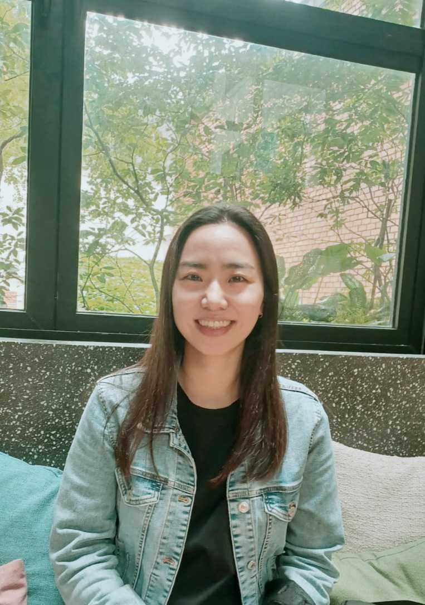

<!-- {:style="float: left;margin-right: 7px;margin-top: 7px;" :height="184px" width="138px"} -->

  

I am a PhD student at the [School of Computing](https://www.comp.nus.edu.sg/), National University of Singapore (NUS), working with [Prof. Ilya Sergey](https://ilyasergey.net/). I am interested in programming languages, specifically with regard to their design aspects. My current projects are about developing (1) a repair tool for ambiguous context-free grammars based on automata theory and (2) a meta-DSL for developing DSLs that enable the language design objectives. My favorite languages are Racket and OCaml. 

Prior to PhD, I was a Research Intern at NUS School of Computing. I have a MSc in Energy Systems from [Skolkovo Institute of Science and Technology](https://www.skoltech.ru/en/), and BS in Finance and Mathematics from [New York University](https://www.nyu.edu/).

I go by my first name, Yunjeong (pronounced as /yeon jeong/).

[![alt text][1.1]][1] &nbsp; [![alt text][1.2]][2] &nbsp; [![alt text][1.3]][3]

 

[1.1]: https://img.icons8.com/material-outlined/30/000000/send.png

[1.2]: https://img.icons8.com/ios-glyphs/30/000000/twitter.png
[1.3]: https://img.icons8.com/ios-filled/30/000000/github.png

[1]: mailto:yunjeong.lee@u.nus.edu
[2]: https://x.com/lyunjeong
[3]: https://github.com/yunjeong-lee
